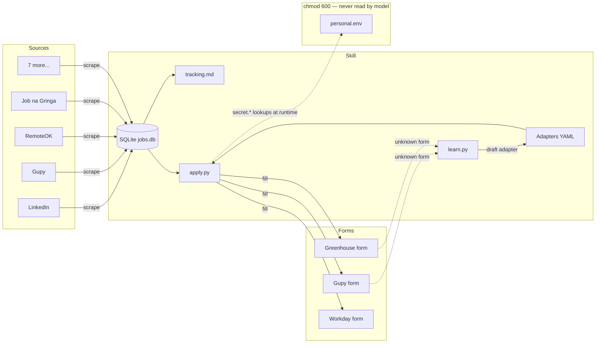

# job-hunter

[](https://github.com/lomartins/job-hunter-skill/actions/workflows/ci.yml)
[](LICENSE)
[](.claude-plugin/marketplace.json)

Discover, track, and assist with senior mobile / Android / Kotlin Multiplatform job applications across LinkedIn, Gupy, RemoteOK, Job na Gringa, and seven more sources. Tracks every opportunity through its lifecycle in a local SQLite DB mirrored to readable Markdown. Fills application forms in two modes — `shadow` (default; pauses for your review) and `auto` (gated by adapter reliability and explicit consent) — using a YAML adapter system that learns from unknown forms and improves over time.

**The skill never sends PII to model servers.** Personal data (CPF, RG, phone, address, salary expectations, session cookies) lives in a `chmod 600` env file the model is forbidden to read. The model only sees field schemas. See [PII isolation](#pii-isolation) below.

## Install

### Recommended: Claude Code plugin marketplace

```
/plugin marketplace add lomartins/job-hunter-skill
/plugin install job-hunter@lomartins-skills
```

### Manual (Claude Code)

```bash
git clone git@github.com:lomartins/job-hunter-skill.git ~/.claude/skills/lomartins-job-hunter-skill
ln -s ~/.claude/skills/lomartins-job-hunter-skill/skills/job-hunter ~/.claude/skills/job-hunter
```

### Codex CLI / Cursor / Gemini CLI

`job-hunter` follows the open Agent Skills standard. Clone into the host's skill dir:

```bash
git clone git@github.com:lomartins/job-hunter-skill.git ~/.codex/skills/job-hunter-skill
# Cursor:  ~/.cursor/skills/
# Gemini:  ~/.gemini/skills/
```

### Install the CLI binary

The skill ships a Python CLI that does the actual work. Install once:

```bash
uv tool install --from git+https://github.com/lomartins/job-hunter-skill.git job-hunter
playwright install chromium
```

This puts `job-hunter` and the shorter alias `job` on your PATH.

## 60-second quickstart

```bash
# 1. Initialize XDG dirs and copy templates
job init

# 2. Edit your profile (no PII — roles, locations, links)
$EDITOR ~/.config/job-hunter/profile.yaml

# 3. Add your secrets (kept out of model context)
$EDITOR ~/.config/job-hunter/secrets/personal.env
chmod 600 ~/.config/job-hunter/secrets/personal.env

# 4. Discover roles from RemoteOK (no auth needed)
job discover --source remoteok

# 5. See what landed
cat ~/.local/share/job-hunter/tracking.md
job list --stage discovered

# 6. Queue something and apply in shadow mode
job queue 7
job apply 7 --mode shadow
```

## Architecture



## Source compatibility

| Source | Phase | Method | Auth | Notes |
|--------|-------|--------|------|-------|
| Job na Gringa | 1 | HTML + Playwright | — | Curated remote roles for BR devs |
| LinkedIn | 1 | Playwright + cookie | `LINKEDIN_LI_AT` | Rate-limited 12–25s |
| Gupy | 1 | HTML | — | `<company>.gupy.io/jobs` |
| RemoteOK | 1 | JSON API | — | Public |
| Remotive | 2 | JSON API | — | Public |
| We Work Remotely | 2 | RSS | — | |
| Himalayas | 2 | HTML/GraphQL | — | |
| Programathor | 2 | HTML | — | BR |
| Coodesh | 2 | HTML | Optional | |
| Trampos.co | 2 | HTML | — | BR |
| Arc.dev | 2 | HTML | Required | |

## Adapter platform support

| Platform | Adapter shipped | Auto-eligible default |
|----------|-----------------|-----------------------|
| Gupy | ✓ | ✗ |
| Greenhouse | ✓ | ✗ |
| Lever | ✓ | ✗ |
| Workday | ✓ | ✗ |
| Ashby | ✓ | ✗ |
| SmartRecruiters | (learned via `learn.py`) | — |
| Recruitee | (learned) | — |
| BambooHR | (learned) | — |
| Personio | (learned) | — |
| Jobvite | (learned) | — |

Auto-eligibility flips on per-signature after three consecutive successful shadow submits and an explicit `job adapter mark-auto-eligible <sig>`.

## PII isolation

The model is forbidden to read `~/.config/job-hunter/secrets/personal.env`. It works against `assets/personal.env.example` (empty-value template) for schema, and the CLI loads real values via `python-dotenv` at runtime in a child process.

CI runs `lint_secret_leaks.py` on every PR; pre-submit checks block any form fill that would echo PII into logs or screenshots. See [`skills/job-hunter/SKILL.md`](skills/job-hunter/SKILL.md#forbidden-actions-pii-isolation) for the full forbidden-action list.

## Contributing

See [`skills/job-hunter/references/decisions.md`](skills/job-hunter/references/decisions.md) for the phase plan and [`skills/job-hunter/references/`](skills/job-hunter/references/) for area-specific docs. New adapters welcome via `job adapter contribute <signature>`.

## License

Apache-2.0. The skill never transmits PII to model servers — see [PII isolation](#pii-isolation) and the [decisions doc](skills/job-hunter/references/decisions.md) for the architectural enforcement.
