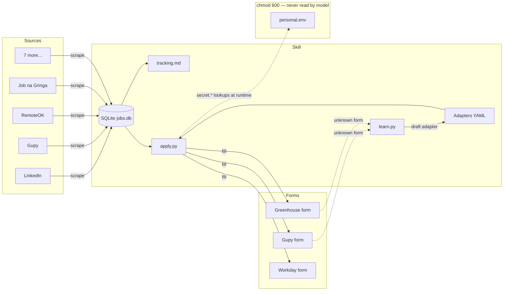

# job-hunter

> A self-hosted, PII-safe job-search command center — for Claude Code, Codex, Cursor, and the terminal.

[](https://github.com/lomartins/job-hunter-skill/actions/workflows/ci.yml)
[](LICENSE)
[](.claude-plugin/marketplace.json)
[](https://www.python.org/)
[](https://github.com/anthropics/claude-code)

Job hunting buried under a hundred tabs? **job-hunter** scrapes job boards, tracks every application kanban-style in a local SQLite DB, fills ATS forms in `shadow` or `auto` mode, surfaces salary distributions from your own pipeline, and tailors a [Reactive Resume](https://github.com/amruthpillai/reactive-resume) per JD — all without ever sending your phone, ID, or session cookies to a model.

Works for **any tech role** — backend, frontend, mobile, data, ML, infra, devrel, security, design-eng. Drop your role keywords in `profile.yaml` once and the same skill works for a senior platform engineer, a junior data analyst, or a staff designer.

## What you get

- **11 sources out of the box** — LinkedIn, Indeed, Glassdoor, Gupy, RemoteOK, Job na Gringa, Remotive, We Work Remotely, Himalayas, Programathor, Coodesh. New scrapers via a `learn.py` adapter that drafts YAML from any unknown form.
- **Full pipeline tracking** — `discovered → queued → applying → applied → screening → technical → behavioral → offer / rejected / withdrawn`, with note-bearing transitions, flagging, and structured tags.
- **Local FastAPI + HTMX webapp** at `127.0.0.1:8765` — kanban tracker with drag-and-drop stage moves, filter by tag/source/stage/flag, sort by match/date/salary, currency conversion (BRL/USD/EUR via free ECB rates), markdown-rendered JDs, daily/weekly application charts.
- **Match score** per job derived from your profile + JD heuristics (seniority, country lock, on-site mismatch, US-clearance, etc.).
- **Salary aggregator** — p25/median/p75 from your own scraped data, no live Glassdoor scraping needed.
- **AI form-fill in two modes** — `shadow` pauses before submit, `auto` requires 5 reliability gates *and* explicit consent.
- **Resume tailoring** — `/job-hunter:tailor-resume <id>` emits Reactive Resume JSON tuned to the JD.
- **Claude Code slash commands** — `discover`, `apply`, `dig`, `tailor-resume`, `validate`, `web`, `tracker`, `status`, `review`, `doctor`.

## PII-safe by design

Your personal data (national ID, phone, address, salary expectations, session cookies) lives in `~/.config/job-hunter/secrets/personal.env` — `chmod 600`, and the **model is explicitly forbidden** to read it via Read tool, cat/head/tail/grep, or any pipe whose output enters the conversation. The CLI loads it via `python-dotenv` in a child process; the model only ever sees field schemas. CI enforces this: `lint_secret_leaks.py` blocks any PR that would echo PII into logs, screenshots, or artifacts.

## Install

### Recommended: Claude Code plugin marketplace

```
/plugin marketplace add lomartins/job-hunter-skill
/plugin install job-hunter@lomartins-skills
```

### Manual (Claude Code)

```bash
git clone git@github.com:lomartins/job-hunter-skill.git ~/.claude/skills/lomartins-job-hunter-skill
ln -s ~/.claude/skills/lomartins-job-hunter-skill/skills/job-hunter ~/.claude/skills/job-hunter
```

### Codex CLI / Cursor / Gemini CLI

`job-hunter` follows the open Agent Skills standard. Clone into the host's skill dir:

```bash
git clone git@github.com:lomartins/job-hunter-skill.git ~/.codex/skills/job-hunter-skill
# Cursor:  ~/.cursor/skills/
# Gemini:  ~/.gemini/skills/
```

### Install the CLI binary

The skill ships a Python CLI that does the actual work. Install once:

```bash
uv tool install --from git+https://github.com/lomartins/job-hunter-skill.git job-hunter
playwright install chromium
```

This puts `job-hunter` and the shorter alias `job` on your PATH.

## 60-second quickstart

```bash
# 1. Initialize XDG dirs and copy templates
job init

# 2. Edit your profile — role keywords drive matching (no PII goes here)
$EDITOR ~/.config/job-hunter/profile.yaml
#   roles: [backend engineer, golang, distributed systems]
#   roles: [senior frontend, react, typescript]
#   roles: [data engineer, dbt, snowflake]
#   roles: [staff android, kotlin, kmp]      # whatever fits you

# 3. Add your secrets (kept out of model context)
$EDITOR ~/.config/job-hunter/secrets/personal.env
chmod 600 ~/.config/job-hunter/secrets/personal.env

# 4. Discover roles from RemoteOK (no auth needed)
job discover --source remoteok

# 5. See what landed
cat ~/.local/share/job-hunter/tracking.md     # human-readable mirror
job list --stage discovered                    # CLI view
job web                                        # or: visual triage in a browser

# 6. Queue something and apply in shadow mode
job queue 7
job apply 7 --mode shadow
```

The webapp listens on `http://127.0.0.1:8765` by default (localhost-only, no auth, no PII exposed). Pass `--port` to override.

## Architecture



## Source compatibility

| Source | Phase | Method | Auth | Firecrawl boost? |
|--------|-------|--------|------|------------------|
| Job na Gringa | 1 | HTML | — | No |
| LinkedIn | 1 | HTML + cookie | `LINKEDIN_LI_AT` | No (cookie auth) |
| Gupy | 1 | HTML | — | No |
| RemoteOK | 1 | JSON API | — | No |
| **Indeed** | **0.9** | **HTML, captcha-aware** | **—** | **Yes** |
| **Glassdoor** | **0.9** | **HTML + cookie or Firecrawl** | **`GLASSDOOR_GD_ID` + `_UAC`** | **Yes** |
| Remotive | stub | JSON API | — | — |
| We Work Remotely | stub | RSS | — | — |
| Himalayas | stub | HTML/GraphQL | — | — |
| Programathor | stub | HTML | — | — |
| Coodesh | stub | HTML | Optional | — |
| Trampos.co | stub | HTML | — | — |
| Arc.dev | stub | HTML | Required | — |

Set `FIRECRAWL_ENDPOINT=http://localhost:3002` in `personal.env` to route Indeed + Glassdoor through a self-hosted Firecrawl instance (handles JS rendering + anti-bot). Apply-path is hard-disabled when Firecrawl is set. See [`references/firecrawl.md`](skills/job-hunter/references/firecrawl.md).

## Salary distribution from your own pipeline

After running discover across a few sources, get the role's salary distribution from the data you've actually seen — no live Glassdoor scraping needed:

```bash
job-hunter discover --source indeed
job-hunter discover --source remoteok
job-hunter salary --role "backend engineer" --location "united states"
job-hunter salary --role "kotlin"           --location brazil
job-hunter salary --role "data engineer"    --location remote
```

Outputs p25 / median / p75 per currency + a suggested expectation (p75 + 10% padding). The `--role` matches against title substrings, so use whichever keyword density matches your search.

## Adapter platform support

| Platform | Adapter shipped | Auto-eligible default |
|----------|-----------------|-----------------------|
| Gupy | ✓ | ✗ |
| Greenhouse | ✓ | ✗ |
| Lever | ✓ | ✗ |
| Workday | ✓ | ✗ |
| Ashby | ✓ | ✗ |
| SmartRecruiters | (learned via `learn.py`) | — |
| Recruitee | (learned) | — |
| BambooHR | (learned) | — |
| Personio | (learned) | — |
| Jobvite | (learned) | — |

Auto-eligibility flips on per-signature after three consecutive successful shadow submits and an explicit `job adapter mark-auto-eligible <sig>`.

## Slash commands (Claude Code plugin install)

| Command | What it does |
|---------|-------------|
| `/job-hunter:discover [source]` | Pull new postings (default: `remoteok`). |
| `/job-hunter:list [filters]` | Pipeline table. |
| `/job-hunter:track <url>` | Track a specific posting + queue it. |
| `/job-hunter:apply <id>` | Preview the form-fill plan (dry-run). |
| `/job-hunter:dig <id>` | Re-fetch JD + brief: fit, friction, tailoring angles, next move. |
| `/job-hunter:tailor-resume <id>` | Generate a [Reactive Resume](https://github.com/amruthpillai/reactive-resume) JSON tailored to the JD. |
| `/job-hunter:validate [id]` | Pre-flag obvious non-fits (junior, country-locked, on-site wrong country). |
| `/job-hunter:web` | Launch the local triage webapp. |
| `/job-hunter:status` | Pipeline summary + suggested next steps. |
| `/job-hunter:review` | Paused adapters + inbox drafts. |
| `/job-hunter:sync` | Regenerate `tracking.md`. |
| `/job-hunter:doctor` | Validate install / perms / deps. |

## PII isolation

The model is forbidden to read `~/.config/job-hunter/secrets/personal.env`. It works against `assets/personal.env.example` (empty-value template) for schema, and the CLI loads real values via `python-dotenv` at runtime in a child process. The webapp reads the SQLite DB only — it never opens the secrets file.

CI runs `lint_secret_leaks.py` on every PR; pre-submit checks block any form fill that would echo PII into logs or screenshots. See [`skills/job-hunter/SKILL.md`](skills/job-hunter/SKILL.md#forbidden-actions-pii-isolation) for the full forbidden-action list.

## Contributing

See [`skills/job-hunter/references/decisions.md`](skills/job-hunter/references/decisions.md) for the phase plan and [`skills/job-hunter/references/`](skills/job-hunter/references/) for area-specific docs. New adapters welcome via `job adapter contribute <signature>`.

## License

Apache-2.0. The skill never transmits PII to model servers — see [PII isolation](#pii-isolation) and the [decisions doc](skills/job-hunter/references/decisions.md) for the architectural enforcement.
